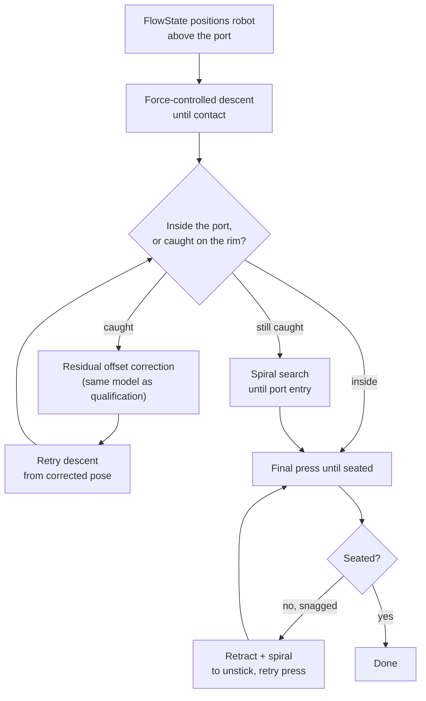

# Phase 1: FlowState Hand-Off & Force-Controlled Insertion

After qualifying, the whole port-detection pipeline from the qualification
round (own YOLO model + triangulation, see
[qualification-phase.md](qualification-phase.md)) was replaced by [Intrinsic
FlowState](https://www.intrinsic.ai/events/ai-for-industry-challenge), using
their intrinsic vision model to position the robot above the target port. The
policy itself became perception-free: no cameras or detection for
localization, just force-controlled motion.

Code: [`Phase1PlugIn.py`](../aic_solution_policy/aic_solution_policy/ros/phase1/Phase1PlugIn.py)
(motion primitives in [`motion.py`](../aic_solution_policy/aic_solution_policy/ros/phase1/motion.py)).

## Pipeline

## How it works

1. **Descent to contact.** The TCP is at the pose FlowState positioned it at
   (plug grasped and aligned above the port). It ramps straight down at a
   fixed velocity until either a tared force threshold trips or the measured
   Z stalls (a hard mechanical stop, whether or not the force reading caught
   it).
2. **Inside vs. caught on the rim.** Comparing how far the TCP actually
   travelled against the assumed port-entrance depth tells whether it went
   straight in or stopped early on the port's edge.
3. **Residual correction, applied at contact.** If it's caught, the same
   offset-correction model from the qualification round (see
   [residual-offset-correction.md](residual-offset-correction.md)) runs on
   the camera images right at the contact pose — the pose it was trained to
   see — retreats clear of the snag, and moves laterally to the corrected
   position before retrying the descent.
4. **Spiral search fallback.** If it's still not inside after the retry, a
   spiral search (same shape as the qualification round's) searches for the
   port entry under constant press force.
5. **Final press + snag recovery.** The plug is pressed in until it stalls at
   a seated depth. A stall short of that depth is treated as a mechanical
   snag: retry with softer rotational stiffness, and after a few failed
   attempts, retract and spiral-search laterally to unstick before pressing
   again.

## Demo

**SC insertion**

<video src="https://github.com/user-attachments/assets/24a9969e-ccff-41e1-bcb1-2e3e374ae856" width="480" controls></video>

**SFP insertion**

<video src="https://github.com/user-attachments/assets/372e5b8e-c86d-4b76-b7c8-ba8532941530" width="480" controls></video>

**Full insertion process** (both connectors, end to end)

<video src="https://github.com/user-attachments/assets/f5bd5886-9559-4a56-973c-9471196d7263" width="480" controls></video>
