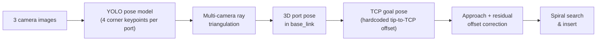

# Qualification Round: Vision-Based Port Detection

This is the approach that got the team from 160 to 27 teams. At this point
nothing about port location was given — the policy had to find the port
itself from camera images before it could do anything else.

Code: [`QualificationPlugIn.py`](../aic_solution_policy/aic_solution_policy/ros/qualification/QualificationPlugIn.py)
(vision in [`vision.py`](../aic_solution_policy/aic_solution_policy/ros/qualification/vision.py),
motion primitives in [`motion.py`](../aic_solution_policy/aic_solution_policy/ros/qualification/motion.py)).

## Pipeline

## How it works

1. **Keypoint detection.** A YOLOv8 pose model, trained on our own labeled
   dataset (see [training/README.md](../training/README.md) and
   [`training/notebooks/train_YOLOv8_pose_colab.ipynb`](../training/notebooks/train_YOLOv8_pose_colab.ipynb)),
   detects each port's 4 corner keypoints in every camera view that sees it.
2. **Triangulation.** For each keypoint, a ray is cast from every camera that
   saw it (using the known camera extrinsics/intrinsics), and the 3D point
   that minimizes distance to all rays is solved via least squares. Four
   triangulated corners give the port's center and orientation.
3. **TCP goal pose.** The port pose is combined with a hardcoded, empirically
   calibrated tip-to-TCP offset (position + orientation) to get the target
   pose for the gripper.
4. **Approach + residual correction.** The arm approaches in one or two
   stages, then the shared offset-correction model (see
   [residual-offset-correction.md](residual-offset-correction.md)) refines
   the pose from the live camera images before the final approach.
5. **Spiral search & insert.** A two-stage spiral search with soft Z
   stiffness lets the plug slip into the port once it finds the opening,
   escalating to a wider/softer second spiral if the first one doesn't
   succeed.

## Suggested visuals

- RViz/Gazebo screenshot of the triangulated 3D port keypoints overlaid on
  the scene (see [docs/media/README.md](media/README.md)).
- A camera frame with the YOLO keypoint detections drawn on it, side by side
  with the triangulated port frame.
