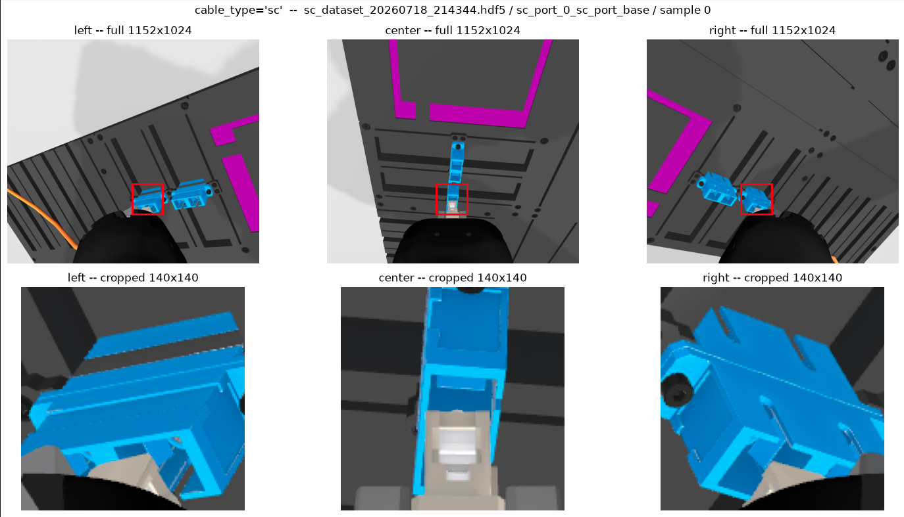
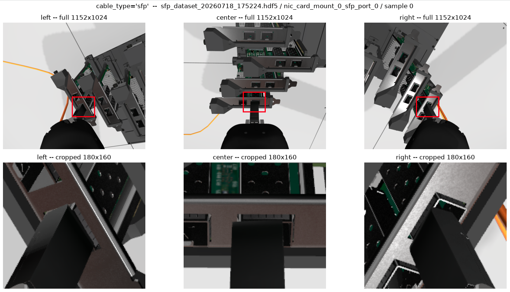
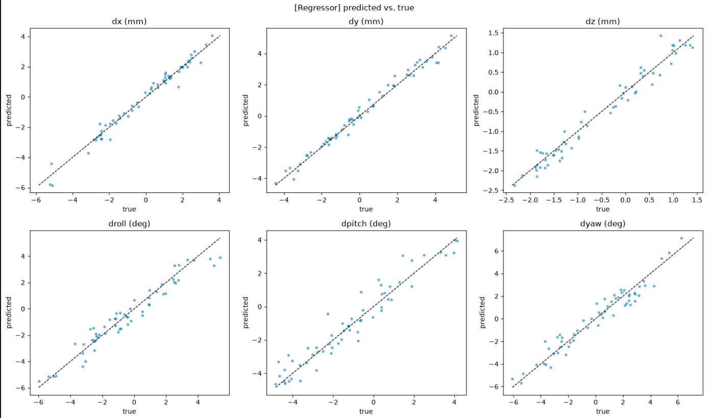
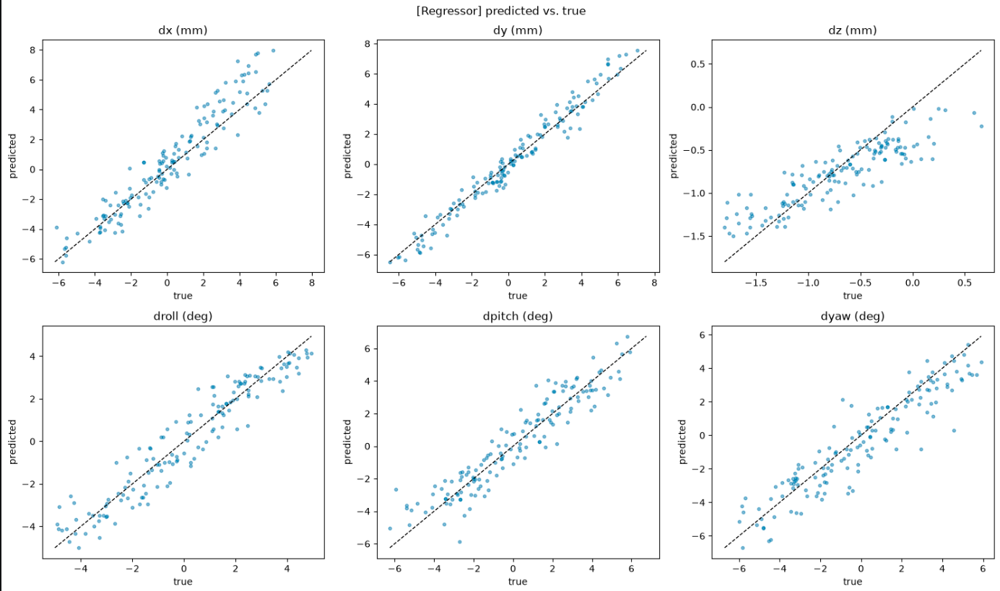

# Residual Offset-Correction Model

Both the [qualification](qualification-phase.md) and [phase 1](phase1-flowstate.md)
policies use the same trained model to nudge their approach pose from camera
images. It's the one piece of the vision stack that survived the switch to
Intrinsic FlowState, because it solves a different problem than port
detection: not "where is the port", but "how far off is the plug tip from
where it should be, right now".

Code: [`residual_offset_model.py`](../aic_solution_policy/aic_solution_policy/ros/residual_offset_model.py).
Training notebook: [`residual_policy.ipynb`](../aic_solution_policy/residual_policy.ipynb).

## What it does

Given the three camera images at the current pose, a ResNet18 encoder (shared
across views) feeds an MLP head that regresses the 6-DoF offset between the
cable tip and the target port: `dx, dy, dz` in meters and `droll, dpitch,
dyaw` in degrees, expressed in the port's own frame. Separate checkpoints are
trained per connector type (`regressor_best_sfp.pt`, `regressor_best_sc.pt`).

In both policies, only the lateral position (`dx`, `dy`) is actually used —
depth and rotation are dropped, since Z is already governed by the
approach/plug depths (qualification) or the force-controlled descent (phase
1), and the connector orientation doesn't need correcting.

## Training data

[`data_acquisition.py`](../aic_solution_policy/aic_solution_policy/data_acquisition.py)
collects the training set: it aligns the cable tip to a port using
ground-truth TF, then repeatedly perturbs that pose by a random offset and
records the three camera images plus the actual tip/TCP/port poses. The
model is trained to recover that offset from the images alone, so at
inference time — with no ground truth available — it can estimate the same
thing from what the cameras see.

## Training data

To focus only on the plug-to-port alignment, a region of interest (ROI) is cropped from each image, as shown below.

  
  

These cropped images are then further augmented using smaller random crops and slight rotations. This encourages the model to focus on the plug-to-port alignment rather than on the gripper itself. At the same time, the augmentation provides additional training data.

## Why it's needed at all

Neither policy's port-pose estimate is perfect: the qualification round's
triangulation has its own noise, and FlowState's placement in phase 1 is good
but not exact. Rather than trying to eliminate that error at the source, this
model estimates it directly from the cameras and folds a correction into the
approach pose before the spiral search — cheaper to train than to chase
perfect calibration.

(where the readme is: src/aic/aic_solution/docs/residual-offset-correction.md)

## Model Evaluation

<table>
  <tr>
    <th>SC</th>
    <th>SFP</th>
  </tr>
  <tr>
    <td align="center">
      
    </td>
    <td align="center">
      
    </td>
  </tr>
  <tr>
    <td valign="top">

The plot shows the prediction error.

The following table provides the final model performance.

| Metric       |   MAE |
| ------------ | ----: |
| dx (mm)      | 0.262 |
| dy (mm)      | 0.250 |
| dz (mm)      | 0.174 |
| droll (deg)  | 0.531 |
| dpitch (deg) | 0.517 |
| dyaw (deg)   | 0.601 |

</td>
    <td valign="top">

The plot shows the prediction error.

The following table provides the final model performance.

| Metric       |   MAE |
| ------------ | ----: |
| dx (mm)      | 0.893 |
| dy (mm)      | 0.499 |
| dz (mm)      | 0.225 |
| droll (deg)  | 0.638 |
| dpitch (deg) | 0.799 |
| dyaw (deg)   | 0.949 |

</td>
  </tr>
</table>
